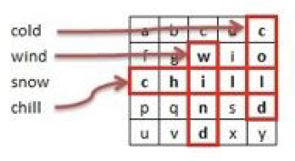

# WordFinder

## Overview

This program is the solution for a Development Challenge with the following sentence:

Presented with a character matrix and a large stream of words, your task is to create a Class
that searches the matrix to look for the words from the word stream. Words may appear
horizontally, from left to right, or vertically, from top to bottom. In the example below, the word
stream has four words and the matrix contains only three of those words ("chill", "cold" and
"wind"):

The WordFinder constructor receives a set of strings which represents a character matrix. The
matrix size does not exceed 64x64, all strings contain the same number of characters. The
"Find" method should return the top 10 most repeated words from the word stream found in the
matrix. If no words are found, the "Find" method should return an empty set of strings. If any
word in the word stream is found more than once within the stream, the search results
should count it only once.

Due to the size of the word stream, the code should be implemented in a high performance
fashion both in terms of efficient algorithm and utilization of system resources. Where possible,
please include your analysis and evaluation.

## Solution

### 1. Analysis
First of all, i started to think in the architecture of the solution, since it is a really simple program and there is no requeriments about how it would be used or how the data would be inserted i thought in a Console App. BUT, since the excercise ask to go further the simple resolution of the problem to 

