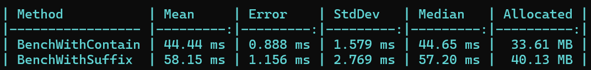

# WordFinder

## Overview

This program is the solution for a Development Challenge with the following sentence:

Objective: The objective of this challenge is not necessarily just to solve the problem but to
evaluate your software development skills, code quality, analysis, creativity, and resourcefulness
as a potential future colleague. Please share the necessary artifacts you would provide to your
colleagues in a real -world professional setting to best evaluate your work.

Presented with a character matrix and a large stream of words, your task is to create a Class
that searches the matrix to look for the words from the word stream. Words may appear
horizontally, from left to right, or vertically, from top to bottom. In the example below, the word
stream has four words and the matrix contains only three of those words ("chill", "cold" and
"wind"):

The WordFinder constructor receives a set of strings which represents a character matrix. The
matrix size does not exceed 64x64, all strings contain the same number of characters. The
"Find" method should return the top 10 most repeated words from the word stream found in the
matrix. If no words are found, the "Find" method should return an empty set of strings. If any
word in the word stream is found more than once within the stream, the search results
should count it only once.

Due to the size of the word stream, the code should be implemented in a high performance
fashion both in terms of efficient algorithm and utilization of system resources. Where possible,
please include your analysis and evaluation.

## Setup
To compile the solution it is only needed to have the .net 8 sdk and a VisualStudio version updated to compile it.
To execute the solution, the app is published in the App folder. Just execute "dotnet WordFinderApp.dll" 

## Solution

### 1. Analysis

#### Architecture
First of all, i started to think in the architecture of the solution, since it is a simple program and there is no requeriments about how it would be used or how the data would be inserted i thought in a Console App. I almost used an API application to show how i design an API, but when i started to think in that design i understood that it would not be useful for that, it wouldn't respect the KISS principle.

#### Algorithm
To resolve the problem itself the first thing i thought was to use ChatGPT, but i wanted before that to think my own solution and then use it in case there is any better solution. My first call was to transform the matrix in a list of strings and then simply use String.Contain, i did some research and saw that it works fine for this amount of characters. Also think about BFS. After that i used ChatGPT and it gave me two possible solutions "suffix arrays" and "Trees".
The trees option wasn't valid because it doesn't work for substrings, and i didn't knowed the suffix array solution so i added it to the project.

Reference link: https://cc.davelozinski.com/c-sharp/fastest-way-to-check-if-a-string-occurs-within-a-string

#### Performance check
To check the different solutions i added a library for Benchmark in .NET and asked chatGPT to creat a big wordStream file for testing with 1million words. It created one with a lot of repeated words that would work and i created another with python with 2million strings without repeating.

After doing the benchmark test i realized that the "Contain" solution is more efficient for my sorprise, so i leaved in that way. 
Now, when tried the solution with a big non repeated stream of words the program takes a lot of time. I started to seek other solutions but i will return the solution to you before continue the research since more efficient solutions appears to be to complex for this case (an interview challenge).
